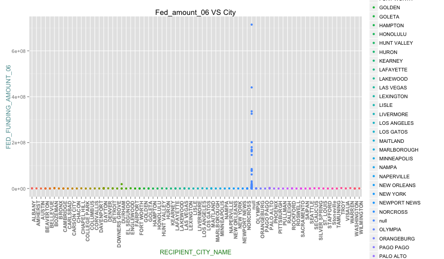

Project 3 required Jeffrey and I to import a multiple large datasets into Oracle Server and call the data into RStudio for analysis. Below will describe the dataset and the following analysis. 

Dataset: GOVSPENDING2007, GOVSPENDING2007, GOVSPENDING2008, GOVSPENDING2009, CENSUSCOUNTY

Description of data:
Every year, the US Federal Government allocates money into different areas such as grants, contracts, loans, insurance, direct payments, and others.Jeffrey and I will concentrate on the Federal Spending - Others which include federal spending on items that were originally not budgeted for in the fiscal year. Below describes the types of funding from the federal government:
A. New assistance action (new program initiatves)
B. Continuation (funding in succeeding budget period which stemmed from prior agreement to fund amount of the current action)
C. Revision (any change in Federal Government's financial obligation or contingent liability in existing assistance transaction amount)
D. Funding adjustment to completed project

[DATA FEEDS AND ARCHIVES DATA DICTIONARY](http://www.usaspending.gov/sites/all/themes/usaspendingv2/Archives_Data_Feeds_Data_Dictionary.pdf) provides additional information on the following data

In order to support further analysis, we are using census data to determine efficacy of the funding.

Oracle SQL Developer: C##CS329E_JCN565
___

__1. Loading of R packages: RCurl, ggplot2, extrafont, jsonlite, dplyr, tidyr, extrafont, jsonlite, reshape2 (R code not shown)__


__2. Import dataset from Oracle server__

```r
source("../01 data/df_06.R",echo = T)
```

```
## 
## > df_06 <- data.frame(fromJSON(getURL(URLencode("129.152.144.84:5001/rest/native/?query=\"select * from GOVSPENDING2006\""), 
## +     httpheader = c(DB  .... [TRUNCATED]
```

```r
tbl_df(df_06)
```

```
## Source: local data frame [161 x 26]
## 
##               UNIQUE_TRANSACTION_ID ACCOUNT_TITLE
## 1  e3de047550aec610222209d0a898fa48          null
## 2  78c176a32903954b17e3f493f0c628f0          null
## 3  b180b4bcbc24a427a21fb28c396024c9          null
## 4  cc3eca56946bb44ec487bbce36b3aab6          null
## 5  b72f3b6c16ff40e006ffa3db0d1f41ea          null
## 6  07f21250f6eca0a9de40b67d63c7280d          null
## 7  3fe0c277a4c6bcb5515589f43d0ea134          null
## 8  4b3c3f74d3e8f58ef775dcc9b4cc24f6          null
## 9  8741b74e9b6851920410b6d60beb262e          null
## 10 67ca0c352a2fed3d95d8247539e60979          null
## ..                              ...           ...
## Variables not shown: RECIPIENT_NAME (fctr), RECIPIENT_CITY_NAME (fctr),
##   RECIPIENT_COUNTY_NAME (fctr), RECIPIENT_ZIP (fctr), RECIPIENT_TYPE
##   (fctr), AGENCY_CODE (fctr), FED_FUNDING_AMOUNT_06 (int),
##   NON_FED_FUNDING_AMOUNT (int), TOTAL_FUNDING_AMOUNT (int),
##   OBLIGATION_ACTION_DATE (fctr), STARTING_DATE (fctr), ENDING_DATE (fctr),
##   PRINCIPAL_PLACE_STATE (fctr), PRINCIPAL_PLACE_CC (fctr),
##   PRINCIPAL_PLACE_ZIP (fctr), AGENCY_NAME (fctr), RECEIP_ADDR1 (fctr),
##   RECEIP_ADDR2 (fctr), FACE_LOAN_GURAN (int), ORIG_SUB_GURAN (int),
##   RECIP_CAT_TYPE (fctr), MAJ_AGENCY_CAT (fctr), RECIPIENT_COUNTRY_CODE
##   (fctr), SERIALID (int)
```

```r
source("../01 data/df_07.R",echo = T)
```

```
## 
## > df_07 <- data.frame(fromJSON(getURL(URLencode("129.152.144.84:5001/rest/native/?query=\"select * from GOVSPENDING2007\""), 
## +     httpheader = c(DB  .... [TRUNCATED]
```

```r
tbl_df(df_07)
```

```
## Source: local data frame [3,024 x 23]
## 
##               UNIQUE_TRANSACTION_ID
## 1  f8a9b16565c78476dcec26d6253be6ad
## 2  4e6e97e327b53d719f64e8344ebbf10f
## 3  59fa389ac740124226c3142208924356
## 4  5eabe25ed17d9d74dd043c8ad2d4296e
## 5  76d4281f8fa283b732b60e7e6762d772
## 6  76df696a9674d281df66654b1db9808c
## 7  63973b7e392bc2063cdbcee33aab37ab
## 8  ec1962fc4d197e67517dfa4cdd0dcb82
## 9  091cdbc45a46864f8d3c977f9b5207a3
## 10 d91c5f680011c7be0b107cfe74ba71ff
## ..                              ...
## Variables not shown: ACCOUNT_TITLE (fctr), RECIPIENT_CITY_NAME (fctr),
##   RECIPIENT_COUNTY_NAME (fctr), RECIPIENT_ZIP (fctr), RECIPIENT_TYPE
##   (fctr), AGENCY_CODE (fctr), FED_FUNDING_AMOUNT_07 (int),
##   NON_FED_FUNDING_AMOUNT (int), TOTAL_FUNDING_AMOUNT (int),
##   OBLIGATION_ACTION_DATE (fctr), STARTING_DATE (fctr), ENDING_DATE (fctr),
##   PRINCIPAL_PLACE_STATE (fctr), PRINCIPAL_PLACE_CC (fctr),
##   PRINCIPAL_PLACE_ZIP (fctr), AGENCY_NAME (fctr), FACE_LOAN_GURAN (int),
##   ORIG_SUB_GURAN (int), RECIP_CAT_TYPE (fctr), MAJ_AGENCY_CAT (fctr),
##   RECIPIENT_COUNTRY_CODE (fctr), SERIALID (int)
```

```r
source("../01 data/df_08.R",echo = T)
```

```
## 
## > df_08 <- data.frame(fromJSON(getURL(URLencode("129.152.144.84:5001/rest/native/?query=\"select * from GOVSPENDING2008\""), 
## +     httpheader = c(DB  .... [TRUNCATED]
```

```r
tbl_df(df_08)
```

```
## Source: local data frame [4,896 x 9]
## 
##               UNIQUE_TRANSACTION_ID
## 1  08d66e98fd7db327996f838fa561623e
## 2  58c766583a6c5a284a6f2f3650dccf4f
## 3  57e56b2df0988fc5b560129c53c3d088
## 4  db00d5d99ad419ecca0e83dab8915299
## 5  0f6cd859b1dbf40f4ff84e7f15191a7c
## 6  4e017e9aeea0080b07449510e270bb00
## 7  8c87cfd5925bdf72c9f93a8d67adabe3
## 8  56ea528a56ade4d912ee5a752e38702c
## 9  bb9bd703821efc304c935a6771126ae8
## 10 59f17815d6a5372f2c90c1589ba0e1d8
## ..                              ...
## Variables not shown: ACCOUNT_TITLE (fctr), RECIPIENT_ZIP (fctr),
##   RECIPIENT_TYPE (fctr), AGENCY_CODE (fctr), FED_FUNDING_AMOUNT_08 (int),
##   AGENCY_NAME (fctr), RECIP_CAT_TYPE (fctr), MAJ_AGENCY_CAT (fctr)
```

```r
source("../01 data/df_09.R",echo = T)
```

```
## 
## > df_09 <- data.frame(fromJSON(getURL(URLencode("129.152.144.84:5001/rest/native/?query=\"select * from GOVSPENDING2009\""), 
## +     httpheader = c(DB  .... [TRUNCATED]
```

```r
tbl_df(df_09)
```

```
## Source: local data frame [3,097 x 5]
## 
##               UNIQUE_TRANSACTION_ID RECIPIENT_ZIP
## 1  e6eff530bc87b5e4b776c62cbfa1fde3     245310230
## 2  168030ed49f771ffb8cd6a7b650ea7e0     286408967
## 3  a54bbd8656d7e4e657f9a95aec3856b9     737420367
## 4  04b65b64190719998ab67e864892f288     980571037
## 5  c27fedc633266a87371d7fe45af78dc7     541663843
## 6  99d92713cb6c47c964e888e3dfc4c02c     386760639
## 7  8ee789de19fc5cfa55765e56b063cd0e     770425312
## 8  a716fff85bf53caf9ab96e6b48b45687     713512383
## 9  aa6b13806c036f58f7ea251483bd429a     398420511
## 10 43cc5749dea503d20e99cea6b4f782b2     900480001
## ..                              ...           ...
## Variables not shown: RECIPIENT_TYPE (fctr), FED_FUNDING_AMOUNT_09 (int),
##   PRINCIPAL_PLACE_STATE (fctr)
```

```r
source("../01 data/dfcensus.R",echo = T)
```

```
## 
## > require("jsonlite")
## 
## > require(dplyr)
## 
## > q = "CENSUS2010POP"
## 
## > i = "UPPER(PRINCIPAL_PLACE_STATE)"
## 
## > k = "UPPER(RECIPIENT_COUNTY_NAME)"
## 
## > dfpop <- data.frame(fromJSON(getURL(URLencode("129.152.144.84:5001/rest/native/?query=\"select  \"i\" ,  \"k\" ,  \"q\"  from CENSUSCOUNTY\""), 
## +   .... [TRUNCATED]
```

```r
tbl_df(dfpop)
```

```
## Source: local data frame [3,194 x 3]
## 
##    UPPER.PRINCIPAL_PLACE_STATE. UPPER.RECIPIENT_COUNTY_NAME. CENSUS2010POP
## 1                      ARKANSAS               JOHNSON COUNTY         25540
## 2                      ARKANSAS             LAFAYETTE COUNTY          7645
## 3                      ARKANSAS              LAWRENCE COUNTY         17415
## 4                      ARKANSAS                   LEE COUNTY         10424
## 5                      ARKANSAS               LINCOLN COUNTY         14134
## 6                      ARKANSAS          LITTLE RIVER COUNTY         13171
## 7                      ARKANSAS                 LOGAN COUNTY         22353
## 8                      ARKANSAS                LONOKE COUNTY         68356
## 9                      ARKANSAS               MADISON COUNTY         15717
## 10                     ARKANSAS                MARION COUNTY         16653
## ..                          ...                          ...           ...
```
__3. Analysis__
First we want to know how many federal funds that each city has. A city could receive the federal funds many times a year and there are also some blank entries (no city names). I did these data wrangling in the following: 


__First I plotted the original dataset for df_06__

```r
source("../03 Visualization/plot1.R",echo = T)
```

```
## 
## > df_06 %>% select(RECIPIENT_CITY_NAME, FED_FUNDING_AMOUNT_06) %>% 
## +     ggplot(aes(x = RECIPIENT_CITY_NAME, y = FED_FUNDING_AMOUNT_06, 
## +         co .... [TRUNCATED]
```

 

__I filtered the blank entries for both df_06 and df_07__


```r
source("../02 Data Wrangling/DR1.R",echo = T)
```

```
## 
## > df_06_city_spending <- df_06 %>% select(RECIPIENT_CITY_NAME, 
## +     FED_FUNDING_AMOUNT_06) %>% filter(RECIPIENT_CITY_NAME != 
## +     "")
```

```r
source("../02 Data Wrangling/DR2.R",echo = T)
```

```
## 
## > df_07_city_spending <- df_07 %>% select(RECIPIENT_CITY_NAME, 
## +     FED_FUNDING_AMOUNT_07) %>% filter(RECIPIENT_CITY_NAME != 
## +     "")
```

__I sum the total funds for each city for both df_06 and df_07__

```r
source("../02 Data Wrangling/DR3.R",echo = T)
```

```
## 
## > df_06_city_total_fund <- df_06_city_spending %>% select(RECIPIENT_CITY_NAME, 
## +     FED_FUNDING_AMOUNT_06) %>% group_by(RECIPIENT_CITY_NAME) %>% 
## +  .... [TRUNCATED]
```

```r
source("../02 Data Wrangling/DR4.R",echo = T)
```

```
## 
## > df_07_city_total_fund <- df_07_city_spending %>% select(RECIPIENT_CITY_NAME, 
## +     FED_FUNDING_AMOUNT_07) %>% group_by(RECIPIENT_CITY_NAME) %>% 
## +  .... [TRUNCATED]
```

__First I used left_join to join df_07_city_total_fund with df_06_city_total_fund. I found that there are many unmatched records in df_06_city_total_fund. So at this point, I am only intertested in the range and quatiles of 2007 city funding without comparing to 2006 city funding. Therefore I made an boxplot for that. From the graph, we can see that there are too many outliers in df_07_city_total_fund. The range is pretty big and the distribution is extremely skewed to the right__


```r
source("../02 Data Wrangling/DR5.R",echo = T)
```

```
## 
## > join_by_city_left <- left_join(df_07_city_total_fund, 
## +     df_06_city_total_fund, by = "RECIPIENT_CITY_NAME")
```

```r
source("../03 Visualization/plot2.R",echo = T)
```

```
## 
## > boxplot(join_by_city_left$total_spending.x, main = "Boxplot", 
## +     xlab = "2007", ylab = "Total_fund")
```

 

__Now I inner join two datasets by city to make more sense__

```r
source("../02 Data Wrangling/DR6.R",echo = T)
```

```
## 
## > join_by_city <- inner_join(df_06_city_total_fund, 
## +     df_07_city_total_fund, by = "RECIPIENT_CITY_NAME")
## 
## > names(join_by_city) <- c("City", "Total_fed_fund_06", 
## +     "Total_fed_fund_07")
```

__Use a beautiful bubble plot to visualize the gragh. First plot bubble plot: fed_fund_06 VS CitiesFrom the bubble graph, we can easily to see the difference of federal fund amount between these cities by the bubble size__

```r
source("../03 Visualization/plot3.R",echo = T)
```

```
## 
## > join_by_city %>% ggplot(aes(x = City, y = Total_fed_fund_06, 
## +     size = Total_fed_fund_06, color = Total_fed_fund_06)) + geom_point() + 
## +     th .... [TRUNCATED]
```

 

__Same for 2007__

```r
source("../03 Visualization/plot4.R",echo = T)
```

```
## 
## > join_by_city %>% ggplot(aes(x = City, y = Total_fed_fund_07, 
## +     size = Total_fed_fund_07, color = Total_fed_fund_07)) + geom_point() + 
## +     th .... [TRUNCATED]
```

 

__Now I will make a boxplot to see the range and quatiles of 2006 fund and 2007 fund. First I did data wrangling__

```r
source("../02 Data Wrangling/DR7.R",echo = T)
```

```
## 
## > df_total_fund <- c(join_by_city$Total_fed_fund_06, 
## +     join_by_city$Total_fed_fund_07)
## 
## > df_total_fund <- data.frame(df_total_fund)
## 
## > df_year <- c(rep(c(2006), each = 45), rep(c(2007), 
## +     each = 45))
## 
## > df_year <- data.frame(df_year)
## 
## > df_fund_year <- data.frame(df_total_fund, df_year)
## 
## > names(df_fund_year) <- c("Total_fund", "Year")
```

__Plot the boxplot. Since there are many big outliers in 2006 and 2007 as we can see, the "box"" is compressed to be very "narrow" (almost a line as we can see). But we can see the median or fifty percentile in 2007 is a little bigger than that in 2006. Moreover, the total_fund of 2006 is more concentrated than that of 2007__

```r
source("../03 Visualization/plot5.R",echo = T)
```

```
## 
## > df_fund_year %>% ggplot(aes(factor(Year), Total_fund)) + 
## +     geom_boxplot() + theme(axis.text.x = element_text(size = 10, 
## +     face = "bold", v .... [TRUNCATED]
```

 


```r
names(dfpop) <- c('PRINCIPAL_PLACE_STATE','RECIPIENT_COUNTY_NAME','POPULATION')
df_state <- dfpop %>% select (PRINCIPAL_PLACE_STATE, POPULATION) %>% group_by(PRINCIPAL_PLACE_STATE) %>% summarise(sum(POPULATION))
df_state06 <- df_06 %>% select (PRINCIPAL_PLACE_STATE, FED_FUNDING_AMOUNT_06) %>% group_by(PRINCIPAL_PLACE_STATE) %>% summarise(sum(FED_FUNDING_AMOUNT_06))
df_state07 <- df_07 %>% select (PRINCIPAL_PLACE_STATE, FED_FUNDING_AMOUNT_07) %>% group_by(PRINCIPAL_PLACE_STATE) %>% summarise(sum(FED_FUNDING_AMOUNT_07))

dfsamestate <- inner_join(df_state06,df_state07,by = 'PRINCIPAL_PLACE_STATE')
mdf <- melt(dfsamestate, id.vars = 'PRINCIPAL_PLACE_STATE', measure.vars = c('sum(FED_FUNDING_AMOUNT_06)', 'sum(FED_FUNDING_AMOUNT_07)'))
mdf %>% ggplot(aes(x = PRINCIPAL_PLACE_STATE, y = value, color = variable)) + geom_point()+theme(axis.text.x=element_text(angle=90, size=10, vjust=0.5)) + labs(title="Governmental Funding Broken Down\nPer Person Per State", y="Total Funding per Person",x="State")
```

 

```r
dffull <- full_join(df_state06,df_state07, by = 'PRINCIPAL_PLACE_STATE')
```

```
## Error in eval(expr, envir, enclos): could not find function "full_join"
```

```r
names(dffull) <- c('PRINCIPAL_PLACE_STATE','FED_FUNDING_AMOUNT_06','FED_FUNDING_AMOUNT_07')
```

```
## Error in names(dffull) <- c("PRINCIPAL_PLACE_STATE", "FED_FUNDING_AMOUNT_06", : object 'dffull' not found
```

```r
dffull2 <- inner_join(dffull, df_state, by = 'PRINCIPAL_PLACE_STATE')
```

```
## Error in inner_join(dffull, df_state, by = "PRINCIPAL_PLACE_STATE"): object 'dffull' not found
```

```r
names(dffull2) <- c('PRINCIPAL_PLACE_STATE','FED_FUNDING_AMOUNT_06','FED_FUNDING_AMOUNT_07', 'POPULATION')
```

```
## Error in names(dffull2) <- c("PRINCIPAL_PLACE_STATE", "FED_FUNDING_AMOUNT_06", : object 'dffull2' not found
```

```r
dffull3 <- dffull2 %>% mutate(perperson06 = FED_FUNDING_AMOUNT_06/POPULATION, perperson07 = FED_FUNDING_AMOUNT_07/POPULATION)
```

```
## Error in eval(expr, envir, enclos): object 'dffull2' not found
```

```r
mdf2 <- melt(dffull3, id.vars = 'PRINCIPAL_PLACE_STATE', measure.vars= c('perperson06','perperson07'))
```

```
## Error in melt(dffull3, id.vars = "PRINCIPAL_PLACE_STATE", measure.vars = c("perperson06", : object 'dffull3' not found
```

```r
mdf2 %>% ggplot(aes(x = PRINCIPAL_PLACE_STATE, y = value, color = variable)) + geom_point()  + theme(axis.text.x=element_text(angle=90, size=10, vjust=0.5)) + labs(title="Governmental Funding Broken Down\nPer Person Per State", y="Total Funding per Person",x="State")
```

```
## Error in eval(expr, envir, enclos): object 'mdf2' not found
```


```r
df_06_total_fund <- df_06_city_spending %>% select(FED_FUNDING_AMOUNT_06) %>% summarise(avg06 = mean(FED_FUNDING_AMOUNT_06))
df_07_total_fund <- df_07_city_spending %>% select(FED_FUNDING_AMOUNT_07) %>% summarise(avg07 = mean(FED_FUNDING_AMOUNT_07))
df_08_total_fund <- df_08 %>% select(FED_FUNDING_AMOUNT_08) %>% summarise(avg08 = mean(FED_FUNDING_AMOUNT_08))
df_09_total_fund <- df_09 %>% select(FED_FUNDING_AMOUNT_09) %>% summarise(avg09 = mean(FED_FUNDING_AMOUNT_09))

bind_cols(df_06_total_fund, df_07_total_fund) %>%bind_cols(df_08_total_fund, df_09_total_fund) %>% gather(,"Average") %>% ggplot(aes(x = key, y = Average, group = 1)) + geom_point() + geom_line()
```

```
## Error in eval(expr, envir, enclos): could not find function "bind_cols"
```
